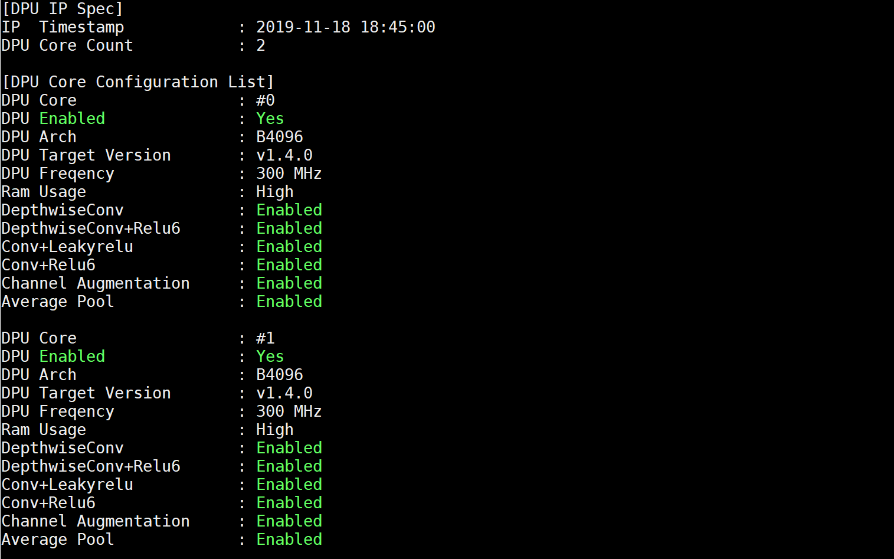

# Vitis-AI-DPU-TRD-for-ZCU16
Port of the DPU_TRD from the ZCU104 to ZCU106 Board with Vitis-AI Libray Support.
This has been tested on the Vitis-AI 1.0 relases of the tools, and Vitis 2019.2

## Step 1: Build ZCU106 Vitis Platform
The Vitis zcu106_dpu platform is based off the zcu104_dpu platform.
To Build the Patform:

Setup up Vitis, PetaLinux, and XRT

~~~bash
source <path to Vitis Install>/Vitis/2019.2/settings64.sh
source <path to Petalinux Install>Petalinux/2019.2/settings.sh
source /opt/xilinx/xrt/setup.sh
~~~

~~~bash
cd zcu106_dpu
make
~~~

When the build is complete the xpm file will be located at:

```zcu106_dpu/platform_repo/zcu106_dpu/export/zcu106_dpu/zcu106_dpu.xpfm```

## Step 2 Download DPU_TRD 
We will configure DPU_TRD to the same dpu config as the zcu104 version. It is has been tesetd of the 1.0 Release of Vitis-AI.

To build:
1. Clone the Vitis 1.0 Tag of the Vitis-AI Tools and go the  DPU_TRD directory

2.  Make the following edits to the makeFile in DPU/TRD/prj/makeFile
* Edit the SDX_PLATFORM line to point the zcu106_dpu.xpm file loaction in
* Change XOCC_OPTs to the following:
```XOCC_OPTS = -t ${TARGET} --platform ${SDX_PLATFORM} --save-temps --config ${DIR_PRJ}/config_file/prj_config_104_2dpu --xp param:compiler.userPostSysLinkTcl=${DIR_PRJ}/strip_interconnects.tcl ```

3. Make the follwing edits to DPU/TRD/prj/dpu/dpu_conf.vh

* Change the line with ``` \`define URAM_DISABLE to \`define URAM_Enable```
* Change the line with ``` \`define RAM_USAGE_LOW to `define RAM_USAGE_High```

~~~bash
cd DPU_TRD/prj/Vitis
make KERNEL=DPU DEVICE=zcu106
~~~

When the build completes the sd card files will be loacted at: DPU_TRD/prj/Vits/binary_contrainer_1/sd_card/

## Step 3 Prepare SD Card 
You will need to format the SD Card with 2 Partitions. This will be easiest to do from a Linux Machine:
* FAT32 Parition Can be 256MB. Copy boot the BOOT.BIN and image.ub here
* ETX4 for the rest. Copy rootfs.tar.gz here and uncompress

Now you can boot the ZCU106 from the SD Card.


## Step 4 Install Vitis AI Package
Install the Vitis AI Package, see page 26 UG1414 (v1.0) for instructions.

After the package is installed you can run from a terminal:

 ```dexplorer -w ``` 
 
 You should see the following:




## Step 5 Install Vitis AI Libraries
Follow the instructions at: https://github.com/Xilinx/Vitis-AI/tree/v1.0/Vitis-AI-Library
* Install ZCU104 Models. 
* Install Vitis-AI LIbrary 1.0
* Install demo vido files
* Install demo image file


